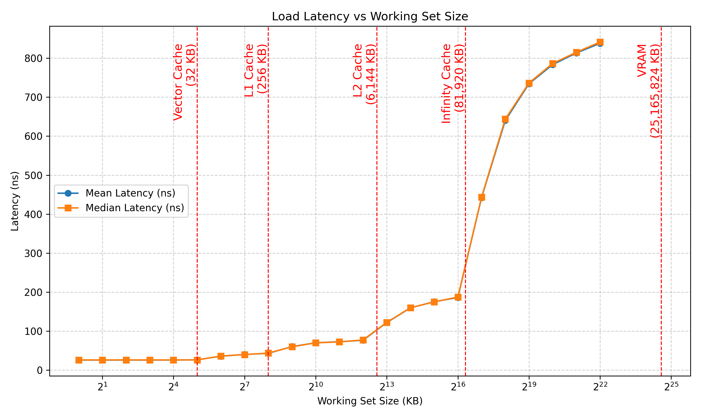

#Coarse Grain Pointer Chase
## Avg Load Latency vs Working Set Size

The plot below shows both mean and median load latency (in nanoseconds) across working set sizes, on a log₂ scale:

---

## Average Latency by Memory Region

| Region | Range (KB) | Avg of Mean Latency (ns) | Avg of Median Latency (ns) |
|---------|-------------|---------------------------|-----------------------------|
| Vector Cache | 0 – 32 | 26.00 | 26.25 |
| L1 Cache | 32 – 256 | 39.75 | 40.00 |
| L2 Cache | 256 – 6,144 | 70.08 | 70.00 |
| Infinity Cache | 6,144 – 81,920 | 160.91 | 161.25 |
| VRAM | 1,048,576 – 25,165,824 | 825.65 | 828.12 |

> Source: [`latency_summary.csv`](./latency_summary.csv)

#Fine Grained Pointer Chase

Fine Grain Pointer Chase 

| Region | Range (KB) | Median Latency (clock cycles) |
|---------|-------------|---------------------------|
| Vector Cache | 0 – 32 | 81 |
| L1 Cache | 32 – 256 | 136 | 
| L2 Cache | 256 – 6,144 | 226.5 |
| Infinity Cache | 6,144 – 81,920 | 485.75 |
| VRAM | 1,048,576 – 25,165,824 | 2463.5 |
